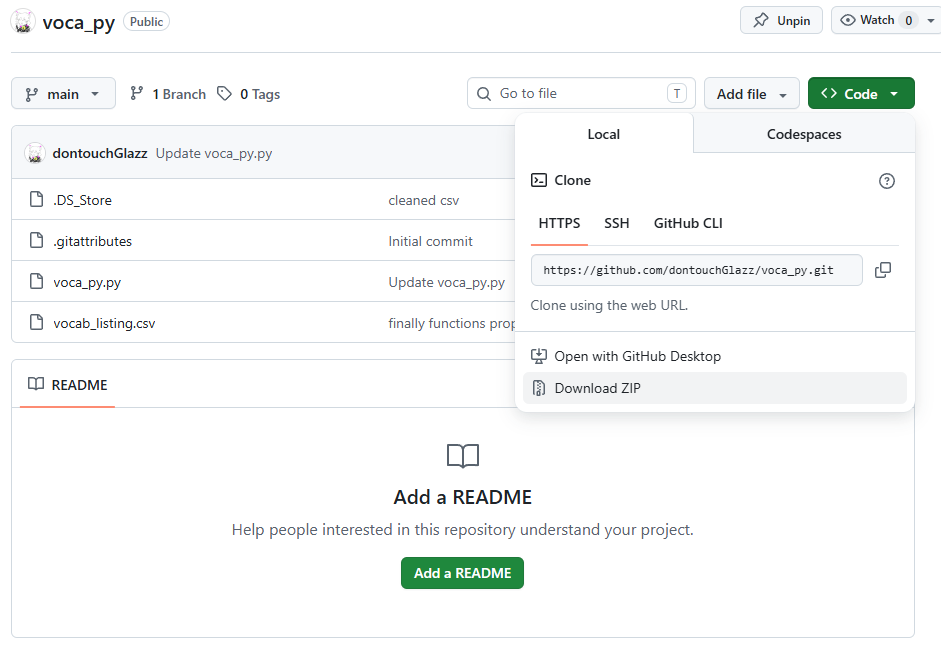
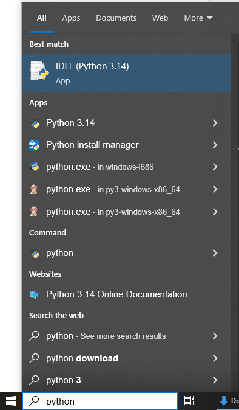
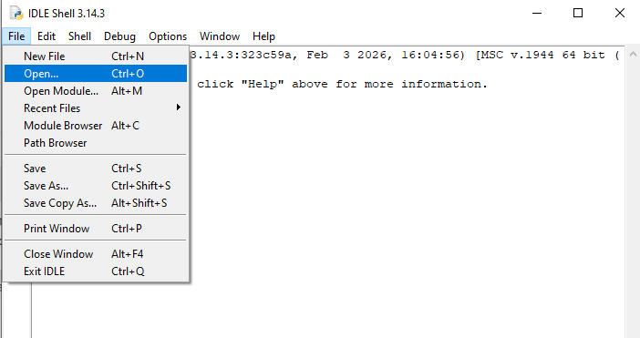
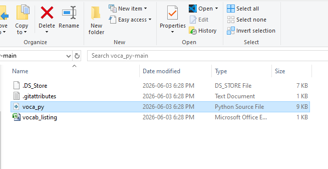
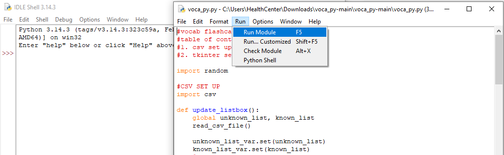
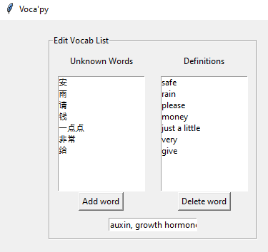
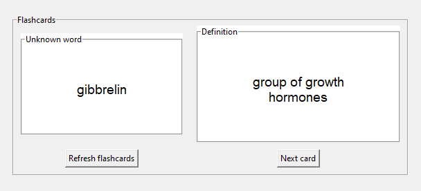

# Voca'py
## What is it?
- flashcard program made in python with tkinter (the language gr 11 compsci teaches)
- made out of hatred for quizlet (too laggy and too many ads)
- Voca is vocab, 'py is python

## How to use Voca'py
### setting up
1. Download Voca'Py as a .zip and unzip it

2. Download Python IDLE (No idea how to run it without IDLE)

3. In IDLE, click on "File", then "Open..." and find "vocab.py" and open it

4. Select the new window with the script that just popped up and click "Run" at the top (f5 on windows, fn+f5 on mac)

Yes you will have to do this every time. Mac users can put the script on their desktop and double click it to open. Sorry Windows.

### using Voca'Py
Vocab list

1. Enter a word into the input field
- your word MUST have a comma in-between the definition and the unknown word
2. Click "Add word" and it will appear in the vocab list
- click on a word in this list then "Delete word" to delete it

Flashcards

1. click on "Refresh Cards" so that the changes to the vocab list reflect in the flashcards
- this also shuffles their order and gets rid of "skibidi, toilet"
